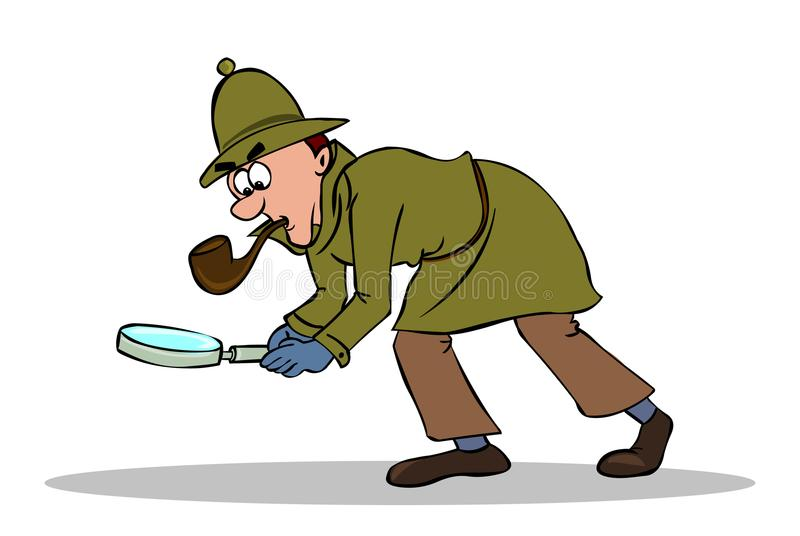

# Šerlokas Project Notes

- Jei stiliaus savybė yra susijusi su tekso stiliumi, tai ji gali būti paveldima is tėviniu elementų;

- Stiliaus savybių šablonas:
    * Savybė: reiksmė;
    * Savybės-pavadinimas: reiksmė;

- Pats elementas atsitraukia nuo kitų aplinkinių elementų, įskaitant ir tėvą :(svarbu parašymo eiliškumas)
    * margin: 10%          - Visomis kryptimis;
    * margin-top: 10%      - Atsitraukiama tik iš viršaus;
    * margin-bottom: 10%   - Atsitraukiama tik iš apačios;
    * margin-left: 10%     - Atsitraukiama tik iš kairės;
    * margin-right: 10%    - Atsitraukiama tik iš dešinės;

- Elementas išsipūčia aplink tūrini: (svarbu parašymo eiliškumas)
    * padding: 10%          - Visomis kryptimis;
    * padding-top: 10%      - Atsitraukiama tik iš viršaus;
    * padding-bottom: 10%   - Atsitraukiama tik iš apačios;
    * padding-left: 10%     - Atsitraukiama tik iš kairės;
    * padding-right: 10%    - Atsitraukiama tik iš dešinės;

- Elementų atvaizdavimo būdai:
    * display: block;        - tai yra daugumos elementų numatytoji atvazdavimo savybe,
                            kai visi elementai rodomi iš viršaus i apačią (vienas po kitu);

    * display: inline-block; - leidžia visus elementus statytį į vieną eilę, horizontaliai,
                                jei tam yra fiziškai vietos;

    * Float: left            - priverstinis elementų suglaudimas į kairę;
    * Float: right           - priverstinis elementų suglaudimas į dešinę;

- Privalomos rašyti stiliaus taisyklės visiems elementams esantiems <body> viduje :
    * display: inline-block;
    * width: 100%;
    * float: left;                    

- Teksto lygiavimas :
    * text-align: center;
    * text-align: left;
    * text-align: right;

- Spalvos pateikimo budai :
    * rgb (220, 222, 159);
    * #EAEBED
    * hsl (220, 1%, 92%)

    * rbg (0, 0 ,0)       - juoda spalva;
    * rbg (255, 255, 255) - balta spalva;
 
<!DOCTYPE html>
<html lang="en">
<head>
    <meta charset="UTF-8">
    <meta http-equiv="X-UA-Compatible" content="IE=edge">
    <meta name="viewport" content="width=device-width, initial-scale=1.0">
    <title>Serloko projektas</title>
</head>

<body style="background-color: #FFFFFF;">
    <main style="display: inline-block;width: 50%;margin-top: 5%;margin-left: 25%;">
        
        

            <h1 style="font-size: 80px;margin: 0%;">404</h1>
            
Atsiprašome, šiuo metu vykdomi techninio aptarnavimo darbai šiame puslapyje

            
Prašome bandyti prisijungti vėliau. Ačiū. 

             
            <a href="http://www.hansab.lt" style="background-color: #c2c2c2;padding: 10px;text-decoration: none; color: #FFFFFF;text-transform: uppercase;">Grįžti atgal </a>
        

    </main>
    
</body>
</html>
